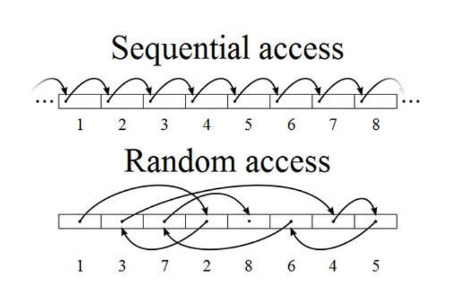

# 1. 처리 과정과 I/O

## 1. SQL 파싱과 최적화

SQL 튜닝에 앞서 `옵티마이저`가 SQL을 어떻게 처리하는지, `서버 프로세스`는 데이터를 어떻게 읽고 저장하는지 살펴보자.&#x20;


### 구조적, 집합적, 선언적 질의 언어

`SQL`은 '**Structured Query Language**'의 줄임말이다. 즉, 구조적 질의 언어이다.

> SQL is designed for a spcific purpose. to query data contained in a relational database.
>
> SQL is a **set-based**, **declarative** query language, not an imperaticve language such as C or BASIC.


## 2. SQL 공유 및 재사용


## 3. 데이터 저장 구조 및 I/O 메커니즘


### 1. SQL이 느린 이유는 디스크 I/O 때문이다

`I/O = 잠(SLEEP)`

I/O를 처리하는 동안 프로세스는 잠을 잔다.

SSD 최신 스토리지는 초당 500 \~ 1000을 읽는다. SQL이 싱글 블록I/O로 10,000블록을 읽는다면 -> 10초

디스크 I/O가 SQL 성능을 좌우한다.


### 2. 논리적 I/O를 줄임으로써 물리적 I/O를 줄이는 것이 곧 SQL 튜닝이다.


#### 1. 데이터베이스 저장 구조

<figure><figcaption></figcaption></figure>

<figure><figcaption></figcaption></figure>

#### 데이터 파일

`데이터 파일`(data file)은 컴퓨터 [응용 소프트웨어](https://ko.wikipedia.org/wiki/%EC%9D%91%EC%9A%A9_%EC%86%8C%ED%94%84%ED%8A%B8%EC%9B%A8%EC%96%B4)이나 [시스템](https://ko.wikipedia.org/wiki/%EC%8B%9C%EC%8A%A4%ED%85%9C_%EC%86%8C%ED%94%84%ED%8A%B8%EC%9B%A8%EC%96%B4)이 사용하는 데이터를 저장하고 있는 [컴퓨터 파일](https://ko.wikipedia.org/wiki/%EC%BB%B4%ED%93%A8%ED%84%B0_%ED%8C%8C%EC%9D%BC)로서, 입출력 데이터를 담고 있다. 데이터 파일은 일반적으로 실행 대상이 되는 명령어나 코드(즉, [컴퓨터 프로그램](https://ko.wikipedia.org/wiki/%EC%BB%B4%ED%93%A8%ED%84%B0_%ED%94%84%EB%A1%9C%EA%B7%B8%EB%9E%A8))를 담고 있지 않다.

수많은 컴퓨터 프로그램은 데이터 파일과 함께 동작한다.

테이블 스페이스, 세그먼트, 익스텐드가 포함


* 데이터 파일: 디스크 상 물리적인 OS 파일
* 테이블 스페이스:  세그먼트를 담는 콘테이너\
  \- **데이터 파일**
* 세그먼트: 데이터 저장공간이 필요한 오브젝트(테이블, 인덱스, 파티션, LOB 등)\
  \- **데이터 파일**
* 익스텐트: 공간을 확장하는 단위. 블록의 집합 \
  \- **하나의 테이블이 독점 한다, 데이터 파일**
* 블록: 데이터를 읽고 쓰는 단위 \
  \- **하나의 테이블이 독점 한다.**


#### 2. 테이블   or 인덱스 블록을 읽는 방법


<figure><figcaption></figcaption></figure>

* 시퀀셜 액세스 : 순서에 따라 차례대로 블록을 읽는 방식. \
  \- **Full Table Scan, 멀티 블록 I/O**
* 랜덤 액세스 : 레코드 하나를 읽기 위하여 한 블록식 접근. \
  \- **Index Range Scan, 싱글 블록 I/O**


`논리적 I/O` : SQL 처리 과정중 발생한 총 블록 I/O

`물리적 I/O` : 디스크에서 발생한 총 블록 I/O


버퍼캐시 히트율(Buffer Cache Hit Ratio)&#x20;

```
BCHR = ( 캐시에서 찾은 블록 수 / 총   읽은 블록 수 ) * 100
     = ( (논리적 I/O - 물리적  I/O) / 논리적 I/O) * 100
     = ( (1 - 물리적 I/O) / (논리적 I/O) ) * 100
```

```
물리적 I/O = 논리적 I/O * (100% - BCHR)
```

BCHR는 시스템 상황에 따라 달라 짐 -> 통제 불가의 요인

따라서 물리적 I/O를 줄일 수 있는 방법은 논리적 I/O를 줄이는 것.


&#x20;

### 3. 캐시경합을 줄이려면, SQL 튜닝을 통해 쿼리 일량(논리적 I/O) 자체를 줄여야 한다.

DB버퍼 캐시 : 이미 조회된 데이터 블록을 저장하는 캐시


하나의 버퍼블록을 두개의 프로세스가 동시에 접근하려고 할때, 경합이 발생

때문에 특정 순간에는 한 프로세스만 사용 할 수 있도록 통제하는 줄세우기 기능이 고려됨 -> `래치(Latch)`

캐시 I/O도 생각 보다 빠르지 않을 수 있다. 경합상황 통제를 위한 래치 때문에


캐시의   버퍼블록 자체에도 직렬화 매커니즘이 존재한다. `버퍼 Lock`

캐시 경합을 줄이려면, SQL 튜닝을 통한 쿼리 일량(논리적 I/O) 자체를 줄여야함.


